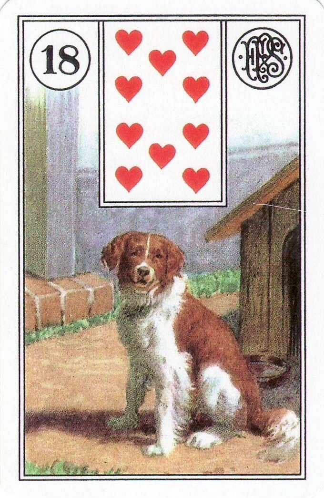
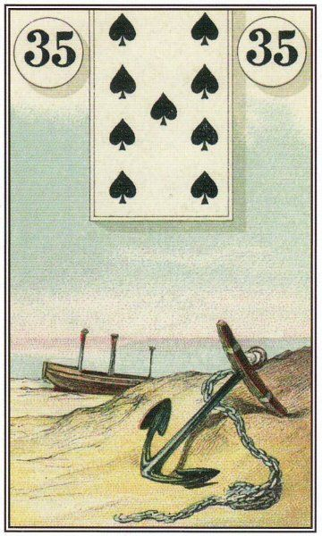
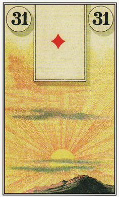
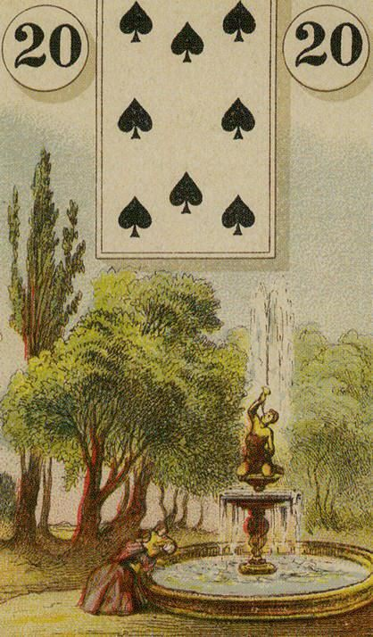
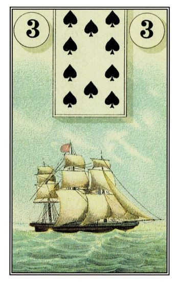
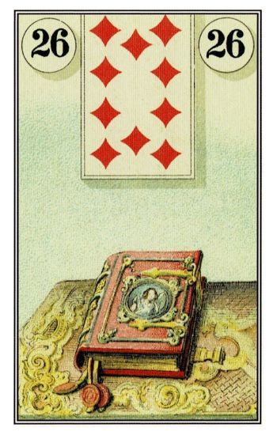

<html lang="pt-br">
  <head>
    <meta charset="UTF-8">
    <meta name="viewport" content="width=device-width, initial-scale=1, maximum-scale=1.0">
    <link rel="stylesheet" href="https://use.fontawesome.com/releases/v5.5.0/css/all.css" integrity="sha384-B4dIYHKNBt8Bc12p+WXckhzcICo0wtJAoU8YZTY5qE0Id1GSseTk6S+L3BlXeVIU" crossorigin="anonymous">
    
    <link href="https://cdn.jsdelivr.net/npm/swiffy-slider@1.6.0/dist/css/swiffy-slider.min.css" rel="stylesheet" crossorigin="anonymous">
    
    <title></title>
    
    <body>
    <!--foto-->
    
    <!-- Titulo -->

    <h1>@Vitor Oliveira <i class="fa fa-coffee" aria-hidden="true"></i></h1>
    
    <!-- Parágrafos-->
     <input type="checkbox" id="btn-a">
          <button id="btn-1">
          <!-- botão pessoa -->
          <label for= "btn-a" >
            
<strong><i class="fa fa-user" aria-hidden="true"></i>Sobre Mim</strong>

          </label>
          </button>
          

            

              
Bem vindo a minha página :), um breve resumo sobre min até por que se eu for escrever tudo aqui vai virar uma biografia kkk.
                
              Sou do Rj Angra dos Reis conhecida muito por ser uma cidade turística, tenho 22 anos Canceriano nato e metade taurino, aberto a todo tipo de conhecimento que agregue no meu  desenvolvimento pessoal, aí que entra meu interesse em tarô e astrologia, estudando e praticando a mais de um ano e sempre tirando disso um novo aprendizado seja para o dia-a-dia pra lidar com pessoas, comunicação entre outras coisas.
                
              Sobre profissão e carreira Atualmente estou  estudando programação front-end que faz parte do desenvolvimento web inclusive esta página foi feita por mim com cores do café mimha bebida favorita por sinal.
                
               Abaixo mais informações sobre contato e consultas online.
              

             

          

           
          <input type="checkbox" id="btn-b">
          <!-- Botão -->
          <button id="btn-2">
          <label for= "btn-b" >
            
<strong><i class="fa fa-list"></i>Contatos</strong>

          </label>
          </button>
        
          

            

           
           <ul id="menu" role="menu">
             <li><a href="https://wa.me/5524992717594?text=Olá+Gostaria+De+Saber+Mais+Sobre+As+Consultas+Online">WhatsApp •  <i class=" fab fa-whatsapp" style="color: white"></i></a></li>
             
             <li><a href="mailto:vitorkw90@gmail.com">Gmail • <i class="fa fa-envelope"></i></a></li>
                          
             <li><a href="https://www.instagram.com/vitorkw89/">Instagram • <i class=" fab fa-instagram"></i></a></li>
              
            <li><a href="https://www.facebook.com/profile.php?id=100078322466753">Facebook • <i class="fab fa-facebook"></i></a></li>  
            
            <li>
(Respondo em 
             30 minutos <i class="fa fa-clock")></i>)
</li>
            </ul>
            
          <!-- Carrocel imagens-->
          
          

          <ul class="slider-container">
              <li></li>
              
              <li></li>
             
              <li></li>
              
              <li></li>
              
              <li></li>
              
              <li></li>
              
              <li></li>
              
              <li></li>
          </ul>

              <button type="button" class="slider-nav"></button>
              <button type="button" class="slider-nav slider-nav-next"></button>

          

              <button class="active"></button>
              <button></button>
              <button></button>
          

       

           
          
Acima algumas cartas do baralho Lenormand que uso inspirado por <a href="https://pt.m.wikipedia.org/wiki/Marie-Anne_Lenormand"><mark>Marie Anne Lenormand</mark></a> famosa oraculista de Napoleão Bonaparte. .
    
          

          

    
             
          <input type="checkbox" id="btn-c">
          <button id="btn-3">
          <label for= "btn-c" >
            
<strong><i class="fa fa-search" aria-hidden="true"></i>Minha Opinião Sobre o tema</strong>

          </label>
          </button>
          

            

              

                A muito mistério quando se fala nesse assunto até por que são poucos que recorrem a alguma ajuda desse oráculo por motivos de preço e acessibilidade, além dos vários charlatões que existem hoje em dia principalmente na internet falando exatamente tudo que você quer ouvir pra te iludir. Tudo que eu estudo em relação a desenvolvimento pessoal eu levo o mais profundo a sério, procuro me ajudar e adquirindo experiência nisso também ajudar as pessoas, como todo estudo e dedicação levam tempo a certo valor a se cobrar por uma consulta seja online ou presencial, pensando nos valores absurdos que já vi penso em algo mais acessível para todos.
                    
                  
                  Talvez uma pergunta sobre isso que todos pensam " isso envolve religião? É algo ruim ? " . Tarot são cartas que mostram situações que acontecem na vida de todos e fazendo a leitura pode se tomar ou não a melhor opção do que se pretende fazer . Muitos que se utilizam deste oráculo ( por sua preferência) misturam sua religião por vontade própria, eu particularmente prefiro não fazer e somente utilizar intuição e estudo aprofundado.
                    
                  Também sendo uma ferramenta que pode ser usada para o bem tanto como mal é fundamental saber com quem você está se consultando e se é uma pessoa ética e confiável e que não vai lhe ocultar nada.
                    
                   Abaixo explico as áreas na qual eu faço as leituras e preços.
                
              

             

          

   
            
          <input type="checkbox" id="btn-d">
          <button id="btn-4">
          <label for= "btn-d" >
            
<strong><i class="fa fa-credit-card" aria-hidden="true"></i>Áreas & preço$ </strong>

          </label>
          </button>
          

            

              <h1>Principais Áreas</h1>
              <ul>
                <li><a>Sentimental (Relacionamentos) • </a><i class="fa fa-heart" style="color:#fff"></i></li>
                
                <li><a>Financeira • $ </a></i></li>
                 
                <li><a>Estudos  • </a><i class="fa fa-book" style="color:#fff"></i></li>
                 
                <li><a>Amizades em geral & Parcerias  • </a><i class="fa fa-handshake" style="color:#fff"></i></li>
 
                <li><a>Familiar  • </a><i class="fa fa-users" style="color:#fff"></i></li>
              </ul>
              
              
<mark>(Observação: não trabalho com qualquer assunto que envolva saúde)</mark>

              
              <h1> Custo & Acessibilidade</h1>
              
Em questão de preço acessível <mark>cada pergunta em qualquer área terá o preço de 10$</mark> já uma <mark>consulta completa de uma hora 60$.</mark>

              
              <h1>Atendimento Online x Presencial</h1>
              
Tanto um quanto o outro precisam ser em hora marcada. O atendimento online é feito por mensagem ou vídeo chamada dependendo da disponibilidade de cada um.

              
              
Caso haja <mark>insatisfação da sua parte seu dinheiro é devolvido e você perde outras chances de se consultar futuramente.</mark>

             
             <h1> Metodos de Pagamento</h1>
             
 • Pix & Boeloto Bancário 

              
             
<mark>(!A consulta só é feita após a formulação das perguntas e do pagamento!)</mark>

             
            
<mark>Só trabalho com questões de serieade e que envolva assuntos pessoais e toda informação passada fica sobre sigilo ético. Não trabalho com áreas relacionadas a jogos e apostas até por que este oráculo não foi desenvolvimento pra isso.</mark>

            
            
Qualquer dúvida sobre o atendimento e outras coisas entre em contato na aba de (contatos)

             

          

    </body>
</html>
